<h1 style="text-align: center;"><strong>QUIZ GAME</strong></h1>

<p align="center">

</p>

# Overview

Welcome to the Quiz Game! This is a simple yet engaging command-line quiz game developed in Python. The game consists of 20 questions, covering a wide range of topics from pop culture to geography. The objective is to answer the questions correctly to earn points. The game is designed to be fun and educational, making it a great way to test your knowledge or learn something new.
<br>
<br>
<p align="center">

</p>


# User Stories

## User Story 1: User Registration
- As a user, I want to enter my name without spaces so that I can participate in the quiz game.
- To achieve this, we need to implement a function that checks for non-blank input and ensures no spaces are entered. The provided code already includes a mechanism for this, but it's important to ensure that the user is informed about the requirement and the process is repeated until a valid name is entered.
```
user_name = input('Enter your name: ')
while not user_name.strip() or ' ' in user_name:
    print("You must enter a name without spaces. Please try again.")
    user_name = input('Enter your name: ')
```
## User Story 2: Reading the Rules
- As a user, I want to read the rules of the quiz game before starting so that I understand how to play.
- To achieve this, we can use the ``get_yes_no_input`` function to ask the user if they want to read the rules. If the user answers 'yes', we display the rules. The provided code already includes this functionality.

## User Story 3: Starting the Quiz
- As a user, I want to confirm if I am ready to start the quiz so that I can begin playing.
- To achieve this, we use the ``get_yes_no_input`` function to ask the user if they are ready to play. If the user answers 'yes', we proceed with the quiz. The provided code already includes this functionality.

## User Story 4: Answering Questions
- As a user, I want to answer questions in lowercase so that my answers are correctly evaluated.
- To achieve this, we use the get_non_blank_input function to collect user answers. This function ensures that the input is not blank and converts the input to lowercase. The provided code already includes this functionality.

## User Story 5: Scoring
- As a user, I want to see my score after answering all questions so that I can know how well I performed.
- To achieve this, we calculate the score by comparing the user's answers with the correct answers. The provided code already includes this functionality, calculating the score and displaying it at the end of the quiz.

## User Story 6: Feedback
- As a user, I want to receive feedback on whether my answers are correct or incorrect so that I can learn from my mistakes.
- To achieve this, we compare the user's answers with the correct answers and print 'Correct' or 'Wrong Answer' accordingly. The provided code already includes this functionality.

## User Story 7: Quiz Completion
- As a user, I want to know when the quiz is over and see my final score so that I can assess my performance.
- To achieve this, we calculate the final score and display it along with a message indicating the quiz is over. The provided code already includes this functionality.

## Implementation Steps:
- User Registration: Use the provided code to collect the user's name, ensuring it does not contain spaces.
- Reading the Rules: Use the ``get_yes_no_input`` function to ask if the user wants to read the rules. If 'yes', display the rules.
- Starting the Quiz: Use the ``get_yes_no_input`` function to confirm the user's readiness to start the quiz.
- Answering Questions: Use the get_non_blank_input function to collect user answers in lowercase.
- Scoring: Compare user answers with correct answers to calculate the score.
- Feedback: Provide feedback on each question based on the user's answer.
- Quiz Completion: Display the final score and a completion message.


# Play Game

## Start 

When the user enters [here](https://a-quiz-game-69878e1225dc.herokuapp.com/), the game starts automatically. Here is a button that restarts the game if the user wants to play the game again.


## Welcome

When the user is about to start playing, a welcome text to the game will appear where the user can key in their user name. Then comes a new text that welcomes with the user's name.

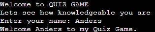

## Rules

When the user has keyed in the user's name, a text appears in green asking if the user wants to read the rules. Answer yes or no.

When the user answers yes, text about rules appears.

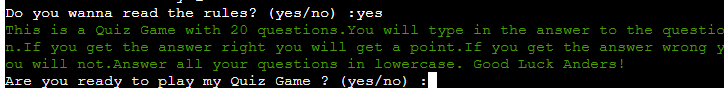

And when the user answers no,

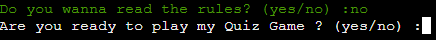

the game continues to the questions.

## Questions

When the user has read the rules or not, the user moves on where the user is asked if the user wants to play yes.20 frågor i olika ämnen. Frågornas text är i gul färg. Svarar användaren rätt kommer texten rätt i grön färg. Svarar användaren fel kommer texten fel svar i röd text.

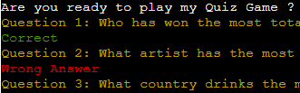

If the user answers no, a text appears and ends the game.

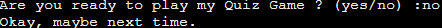

## End of the game

When the user has answered all the questions, the final result shows how many questions were correct and how many points the user got. Then the player is thanked for playing.

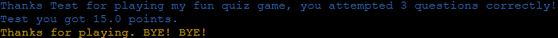


## Installation

You need to have Python installed on your system. The game uses the `colored` library for colored output, so you will need to install it using pip:

```
pip install colored
```

You can use the pip Install Command: Once you are in the correct directory, you can install the packages listed in your requirements.txt file by running the following command in your terminal:

```
pip install -r requirements.txt
```


## Usage
- Here you can find the repository [click here](https://github.com/AndersH82/a_quiz_game.git)
- Clone the repository or download the `run.py` file.
- Open your terminal or command prompt.
- Navigate to the directory containing `run.py`.
- Run the game by executing the following command:

```
python run.py
```
- Follow the on-screen instructions to play the game.

- If you don't want to play in the terminal, you can go [here](https://a-quiz-game-69878e1225dc.herokuapp.com/)  and there to play via the browser.


## Languages used

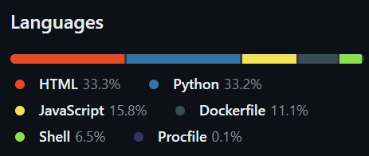

## Features

- Colorful Interface: The game uses the colored library to display text in different colors, making it more visually appealing and easier to follow.
- User Input Validation: The game includes functions to validate user input, ensuring that the user provides a valid answer for each question.
- Quiz Rules and Instructions: Before starting the game, users have the option to read the rules. This includes information about the game's structure, scoring system, and how to answer questions.
- Score Calculation: At the end of the game, the user's score is calculated based on the number of correct answers, and the percentage of correct answers is displayed.
- Unit Testing: The game includes unit tests to ensure the functionality of the input validation functions works as expected.

## Future features

- Category-based Questions: Introduce categories for questions (e.g., Movies, Music, Geography) to make the game more interesting and challenging. Users can choose a category before starting the quiz, and the questions will be filtered based on their selection.

- Timer for Each Question: Implement a timer for each question to add a time-based challenge. If the user doesn't answer within the given time, the question is considered wrong.

- Multiple Choice Questions: Convert some questions into multiple-choice format. This can make the game more interactive and user-friendly, especially for users who prefer not to type answers.

- Leaderboard: Implement a leaderboard feature to keep track of the top scores. Users can enter their initials or names to be displayed on the leaderboard, encouraging competition.

- Difficulty Levels: Introduce difficulty levels (easy, medium, hard) for questions. Users can choose a difficulty level before starting the quiz, and the questions will be adjusted accordingly.

- Random Questions: Instead of a fixed set of questions, randomly select questions from a larger pool. This ensures that each game is unique and challenging.

Flowchart Steps:
1. Start
2. Define Colors
3. Function: get_non_blank_input
    - Input question
    - Loop until non-blank answer
    - Return lowercase answer
4. Function: get_yes_no_input
    - Input question
    - Loop until 'yes' or 'no'
    - Return lowercase answer
5. Input User Name
    - Loop until valid name (no spaces)
6. Welcome Message
7. Check if User Wants to Read Rules
    - Yes: Display rules
    - No: Proceed to next step
8. Check if User is Ready to Play
    - Yes: Proceed to Quiz
    - No: End Program
9. Quiz Logic
    - Initialize score and total questions
    - Loop through questions
        - Display question
        - Get user answer
        - Check if answer is correct
            - Yes: Increment score
            - No: Continue
    - Calculate and display score
10. End Program

### Flowchart Representation:

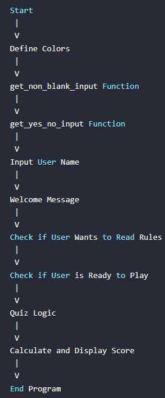

## Program and libraries used

- [Codeanywear](https://codeanywhere.com/) -  for coding
- [Github](https://github.com/) - github.com for deployment
- [Replit](https://replit.com/) - replit.com for coding
- [Grammarly](https://www.grammarly.com/) - grammarly.com for grammar and spelling
- [Mentimeter](https://www.mentimeter.com/) - mentimeter.com for questions
- [Studytonight](https://www.studytonight.com/) - studytonight.com  for coloring the text
- [W3schools](https://www.w3schools.com/) - w3schools.com for input codes
- [Youtube](https://www.youtube.com/) - youtube.com for research
- [Codewof](https://codewof.co.nz/) - codewof.co.nz for checking the PEP8 style
- [Heroku](https://heroku.com) - heroku.com for deployment
- Unittest - for testing the code in the terminal
- Pycodstyle - testing of code style in the terminal

## Color scheme


Color and location

- Blue - End text
- Green - Rules and correct answer
- Yellow - Questions
- Golden Gate Bridge - Start button
- Red - Wrong answer
- White - Text and body html
- Gray - Border start button
- Black - Game terminal


## Testing

#### Unittest

To install the `unittest` framework, you don't need to do anything special because `unittest` is a standard module included in Python's standard library. This means it comes pre-installed with Python, so you can start using it right away without needing to install anything. You can simply import it in your Python code using the following statement:

```
import unittest
```
Once you have imported the `unittest` module, you can use its classes and methods to write and run unit tests for your Python code. This framework is designed to make it easy to write small, isolated tests that verify the behavior of individual parts of a program, supporting the creation of test fixtures and the automatic discovery of test cases.

The `test.py` script uses the `unittest` framework for structuring and running the tests. It also leverages the `unittest.mock` library to simulate user input during testing, ensuring that the tests are deterministic and do not depend on actual user interaction.

#### Test Cases

`test_get_yes_no_input_yes`: Tests the `get_yes_no_input` function with a mocked input of 'yes'.
`test_get_yes_no_input_no`: Tests the `get_yes_no_input` function with a mocked input of 'no'.
`test_get_yes_no_input`: Tests the `get_yes_no_input` function with a mocked input of 'yes' for a different prompt.
`test_get_non_blank_input`: Tests the `get_non_blank_input` function with a mocked input of 'john'.

#### Running the test
To run the tests, execute the following command in your terminal:

```
python -m unittest test.py
```

#### Dependencies

Python 3.3 or higher
unittest and unittest.mock libraries (included in the Python Standard Library)

#### Result

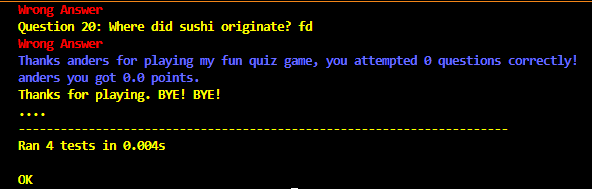


### Manual Tests

- This test shows how the user is not allowed to use spaces in the username and when the user has typed correctly the users can continue
<p>
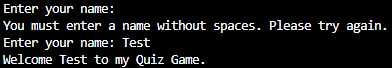
</p>

- This test shows whether the user wants to read the rules by answering yes or no

<p>
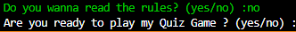
</p>
<p>
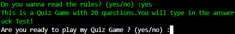
</p>

- This test shows whether the user wants to start the game by answering yes or no

<p>
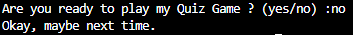
</p>
<p>
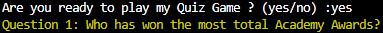
</p>

- This test shows whether the user answers correctly or incorrectly. It also shows if the user does not answer the question.

<p>
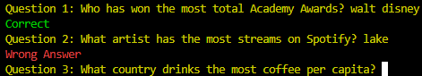
</p>
<p>
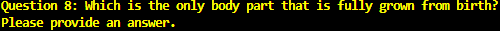
</p>

- And in the last part, the user gets to see the result calculated on how many right and wrong the user has.

<p>
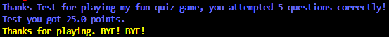
</p>


### PEP8 test

#### How to run pycodestyle test

To run a `pycodestyle` test, you can either use the command line interface or integrate it into your Python code for automated testing. Here's how to do both:

#### Using the Command Line Interface

- Installation: First, ensure `pycodestyle` is installed. If not, you can install it using pip:

```
pip install pycodestyle
```

- Running pycodestyle: To check a Python file or directory for PEP 8 compliance, use the following command:

```
pycodestyle run.py
```

## Deployment

### Heroku

- Sign Up for a Heroku Account: If you don't already have a Heroku account, you'll need to sign up for one. This is a necessary step to access [Heroku's](https://heroku.com) services and deploy your application.

- Create a Heroku App: After signing up, create a new application on Heroku. This can be done through the [Heroku](https://heroku.com) dashboard by clicking on "New" > "Create new app". Give your app a name and choose a region for your app's deployment.

- Link Your GitHub Repository: Heroku allows you to deploy directly from a GitHub repository. To do this, navigate to the "Deploy" tab in your Heroku app's dashboard. Under "Deployment method", select "GitHub" and connect your GitHub account. Then, search for the repository you want to deploy and click "Connect".

- Configure Automatic Deploys (Optional): If you want Heroku to automatically deploy your application whenever you push to a specific branch on GitHub, you can enable "Automatic deploys" from the same "Deploy" tab. This is useful for continuous deployment workflows.

- Deploy Your Application: Once your GitHub repository is connected, you can deploy your application by clicking on "Deploy Branch" in the "Deploy" tab. You can choose the branch you want to deploy from your GitHub repository. If you have automatic deploys enabled, Heroku will automatically deploy your application whenever you push to the selected branch.

- View Your Deployed Application: After your application has been deployed, you can view it by clicking on "Open app" in the "Overview" tab of your Heroku app's dashboard. This will take you to the URL where your application is hosted.

## Contributing
Contributions to the Quiz Game are welcome! If you have suggestions for new questions or improvements to the game, please feel free to open an issue or submit a pull request.