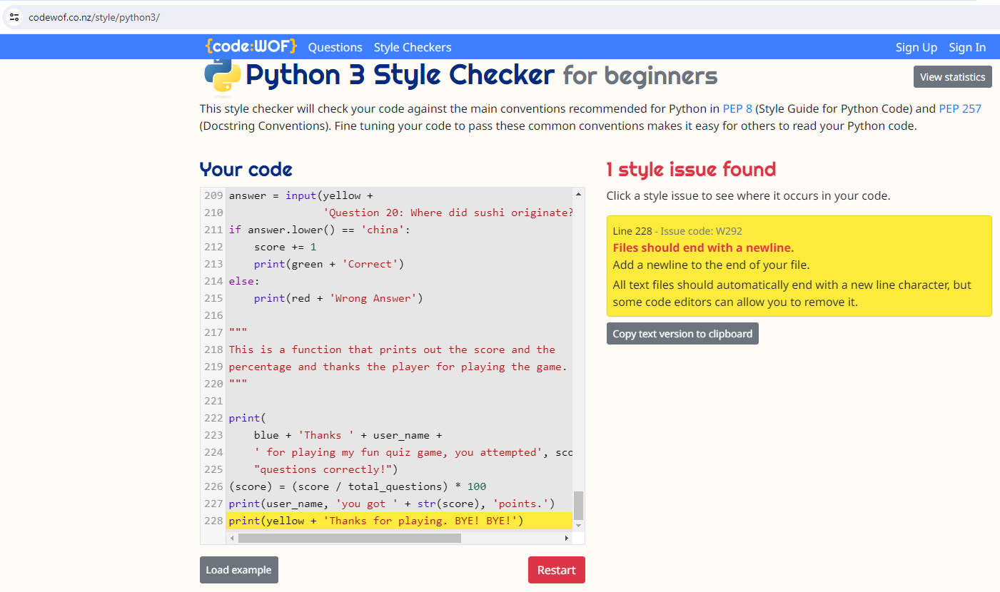

## Welcome,

This is a small game called a-quiz-game. As its sounds it is a Quiz Game and its 20 questions for the player to answer.

## Structure of the game

- The player start the game by entering player name.
``` 
user_name = input('Enter your name: ')
print('Welcome ' + user_name + ' to my Quiz Game.')
```

- Then the player gonna get a question to answer if player wanna read the rulse yes or no.
```
answer = input('Do you wanna read the rules? (yes/no) :')
if answer.lower() == 'yes':
    print(
        green +
        'This is a Quiz Game with 20 questions.'
        'You will type in the answer to the question.'
        'If you get the answer right you will get a point.'
        'If you get the answer wrong you will not.'
        'Answer all your questions in lowercase. Good Luck ' + user_name + '!')
```
- After you answer the rules question the computer ask you to answer if u wanna play game.
```
answer = input(white + 'Are you ready to play my Quiz Game ? (yes/no) :')
```
- Then the games starts if the player answer yes.

```
answer = input(yellow +
                   'Question 1: Who has won the most total Academy Awards? ')
if answer.lower() == 'walt disney':
    score += 1
    print(green + 'Correct')
else:
    print(red + 'Wrong Answer')
```
- When the game is over the player gets the score of correct answer and percentage.

```
print(
    blue + 'Thanks ' + user_name +
    ' for playing my fun quiz game, you attempted', score,
    "questions correctly!")
(score) = (score / total_questions) * 100
print(user_name, 'you got ' + str(score), 'points.')
print(yellow + 'Thanks for playing. BYE! BYE!')
```

## Rules
- Here u have the ruls of the game.
- You can choose to read the rules or not.
- The rules are simple.


## Program and libraries used

- Codeanywear - codeanywhere.com for coding
- Github - github.com for deployment
- Replit - replit.com for coding
- Grammarly - grammarly.com for gramar and spelling
- Mentimeter - mentimeter.com for questions
- Studytonight - studytonight.com  for coloring the text
- W3schools - w3schools.com for input codes
- Youtube - youtube.com for research
- Codewof - codewof.co.nz for checking the PEP8 style
- Heroku - heroku.com for deployment

## Style error

Have made a PEP8 style check and it warns me for an issue code: W292

- File should end with a newline, i have tried but cant get that to be fixed. Its not a problem for the game just a style thing.

