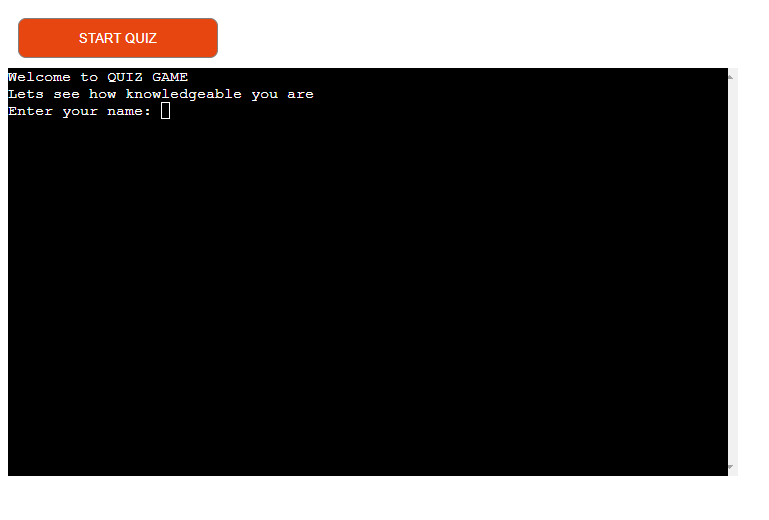

<h1 style="text-align: center;"><strong>QUIZ GAME</strong></h1>

<p align="center">

</p>

# Overview

Welcome to the Quiz Game! This is a simple yet engaging command-line quiz game developed in Python. The game consists of 20 questions, covering a wide range of topics from pop culture to geography. The objective is to answer the questions correctly to earn points. The game is designed to be fun and educational, making it a great way to test your knowledge or learn something new.
<br>
<br>
<p align="center">

</p>

## Features

- Colorful Interface: The game uses the colored library to display text in different colors, making it more visually appealing and easier to follow.
- User Input Validation: The game includes functions to validate user input, ensuring that the user provides a valid answer for each question.
- Quiz Rules and Instructions: Before starting the game, users have the option to read the rules. This includes information about the game's structure, scoring system, and how to answer questions.
- Score Calculation: At the end of the game, the user's score is calculated based on the number of correct answers, and the percentage of correct answers is displayed.
- Unit Testing: The game includes unit tests to ensure the functionality of the input validation functions works as expected.

# Play Game

## Start 

When the user enters [here](https://a-quiz-game-69878e1225dc.herokuapp.com/), the game starts automatically. Here is a button that restarts the game if the user wants to play the game again.


## Welcome

When the user is about to start playing, a welcome text to the game will appear where the user can key in their user name. Then comes a new text that welcomes with the user's name.


## Rules

When the user has keyed in the user's name, a text appears in green asking if the user wants to read the rules. Answer yes or no.

When the user answers yes, text about rules appears.


And when the user answers no,


the game continues to the questions.

## Questions

When the user has read the rules or not, the user moves on where the user is asked if the user wants to play yes.20 frågor i olika ämnen. Frågornas text är i gul färg. Svarar användaren rätt kommer texten rätt i grön färg. Svarar användaren fel kommer texten fel svar i röd text.


If the user answers no, a text appears and ends the game.


## End of the game

When the user has answered all the questions, the final result shows how many questions were correct and how many points the user got. Then the player is thanked for playing.


## Installation

You need to have Python installed on your system. The game uses the `colored` library for colored output, so you will need to install it using pip:

```
pip install colored
```

You can use the pip Install Command: Once you are in the correct directory, you can install the packages listed in your requirements.txt file by running the following command in your terminal:

```
pip install -r requirements.txt
```


## Usage
- Here you can find the repository [click here](https://github.com/AndersH82/a_quiz_game.git)
- Clone the repository or download the `run.py` file.
- Open your terminal or command prompt.
- Navigate to the directory containing `run.py`.
- Run the game by executing the following command:

```
python run.py
```
- Follow the on-screen instructions to play the game.

- If you don't want to play in the terminal, you can go [here](https://a-quiz-game-69878e1225dc.herokuapp.com/)  and there to play via the browser.


## Languages used


## Program and libraries used

- [Codeanywear](https://codeanywhere.com/) -  for coding
- [Github](https://github.com/) - github.com for deployment
- [Replit](https://replit.com/) - replit.com for coding
- [Grammarly](https://www.grammarly.com/) - grammarly.com for grammar and spelling
- [Mentimeter](https://www.mentimeter.com/) - mentimeter.com for questions
- [Studytonight](https://www.studytonight.com/) - studytonight.com  for coloring the text
- [W3schools](https://www.w3schools.com/) - w3schools.com for input codes
- [Youtube](https://www.youtube.com/) - youtube.com for research
- [Codewof](https://codewof.co.nz/) - codewof.co.nz for checking the PEP8 style
- [Heroku](https://heroku.com) - heroku.com for deployment
- Unittest - for testing the code in the terminal
- Pycodstyle - testing of code style in the terminal

## Color scheme


Color and location

- Blue - End text
- Green - Rules and correct answer
- Yellow - Questions
- Golden Gate Bridge - Start button
- Red - Wrong answer
- White - Text and body html
- Gray - Border start button
- Black - Game terminal


## Testing

#### Unittest

To install the `unittest` framework, you don't need to do anything special because `unittest` is a standard module included in Python's standard library. This means it comes pre-installed with Python, so you can start using it right away without needing to install anything. You can simply import it in your Python code using the following statement:

```
import unittest
```
Once you have imported the `unittest` module, you can use its classes and methods to write and run unit tests for your Python code. This framework is designed to make it easy to write small, isolated tests that verify the behavior of individual parts of a program, supporting the creation of test fixtures and the automatic discovery of test cases.

The `test.py` script uses the `unittest` framework for structuring and running the tests. It also leverages the `unittest.mock` library to simulate user input during testing, ensuring that the tests are deterministic and do not depend on actual user interaction.

#### Test Cases

`test_get_yes_no_input_yes`: Tests the `get_yes_no_input` function with a mocked input of 'yes'.
`test_get_yes_no_input_no`: Tests the `get_yes_no_input` function with a mocked input of 'no'.
`test_get_yes_no_input`: Tests the `get_yes_no_input` function with a mocked input of 'yes' for a different prompt.
`test_get_non_blank_input`: Tests the `get_non_blank_input` function with a mocked input of 'john'.

#### Running the test
To run the tests, execute the following command in your terminal:

```
python -m unittest test.py
```

#### Dependencies

Python 3.3 or higher
unittest and unittest.mock libraries (included in the Python Standard Library)

#### Result


### PEP8 test

#### How to run pycodestyle test

To run a `pycodestyle` test, you can either use the command line interface or integrate it into your Python code for automated testing. Here's how to do both:

#### Using the Command Line Interface

- Installation: First, ensure `pycodestyle` is installed. If not, you can install it using pip:

```
pip install pycodestyle
```

- Running pycodestyle: To check a Python file or directory for PEP 8 compliance, use the following command:

```
pycodestyle run.py
```
## Deployment

Quiz Game is deployed on [Heroku](http://heroku.com) and you can see the app here [click here](https://a-quiz-game-69878e1225dc.herokuapp.com/) 

## Contributing
Contributions to the Quiz Game are welcome! If you have suggestions for new questions or improvements to the game, please feel free to open an issue or submit a pull request.